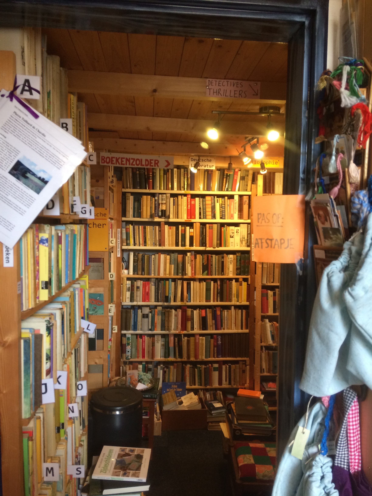

# One Wish

**This is the way the world is saved.**
No superhero came forward in the time of need. No incredible feat of leadership emerged to light the way. But, in a dusty first-floor room, deep within the alleys of a city that forgets parts of itself, the artefact was found. Several times it was a lamp, and the finder laughed at the unoriginality. Often in the early days it was an orb, or a peculiar stone; the benefactor of the artefact experimented. Once it was found as a cassette player, once a disconnected telephone, once a long red glove. In recent times, the benefactor has opted for simpler forms.

Each item, however, is found. Someone, *somewhere*, knocks unprompted on the door of a derelict dry cleaners’ on the way to return a borrowed pan, and finds the door unlocked. They brush aside tubes and wires that dangle like slick vines behind the dumpsters graffitied with symbols of anonymous resentment and pride. Set slightly off the path they intended to take, the finder sees a building made almost, but not quite, of stone. Nobody else is inside. This is the important part. The finding must be done alone. For a brief moment, the benefactor explores the finder’s mind, deciding how to appear. The appearance occurs, and the wishes are offered. The stipulation is explained. One wish, contrary to the popular expectation of three. Oh, you can settle for three; a seemingly chance encounter, a few gold pieces, and a new pot so you don’t need to borrow one every time. Many finders have taken three wishes, and gone to enjoy the rewards or to lie awake dreaming of better ones. There’s no shame in three wishes. But three wishes doesn’t save the world.

No, some have thought about this before. The occasional finder doesn’t want to make their enemies grow warts and help their friend find a better job, and cure their neighbour’s cough. This is where the stipulation comes in. One wish, these finders are given. The wish they have been thinking about since they were old enough to hear stories. Enough food for all, and shared equally too. An end to crime and sickness and unnecessary deaths throughout the city. A stop to the war draining the families around them of bodies and igniting others, solutions to a particular cruelty humanity has spiralled to once again, protection from a predicted epidemic or superhurricane. The benefactor nods, agrees, and explains the stipulation.

For the wish to be granted, the finder must leave their world. No goodbyes can be said, no arguments resolved. They will live to see their wish fulfilled, but not among those who helped them dream of it. Those few will wonder why the finder never returned from their regular walk on the dusty streets, why messages and enquiries were never returned. Those affected by the wish might choose someone to thank, a deity usually, or might remain oblivious. The world of the finder will change in other ways. Some might move on. The finder never can; they remain tied to their world, but unable to enter it, as though they are glued to the outside of a snowglobe. Forced to spiral through identities, the finder will only be able to touch the lives of those they knew for a moment at a time. Those with mysterious disappearances in the family often remark on the kindness of strangers. Some will choose to live this life for one wish instead of three.
Those who wish for superiority over others are incinerated on the spot.

